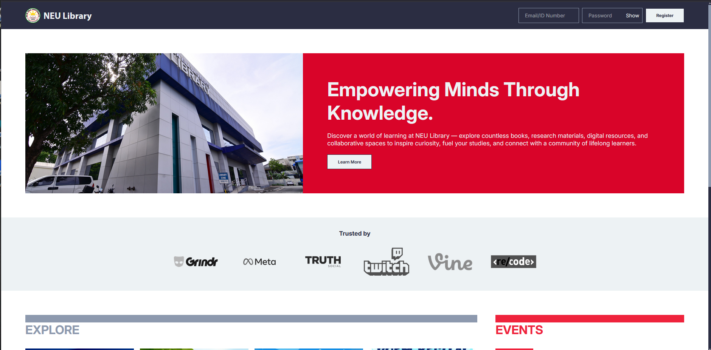
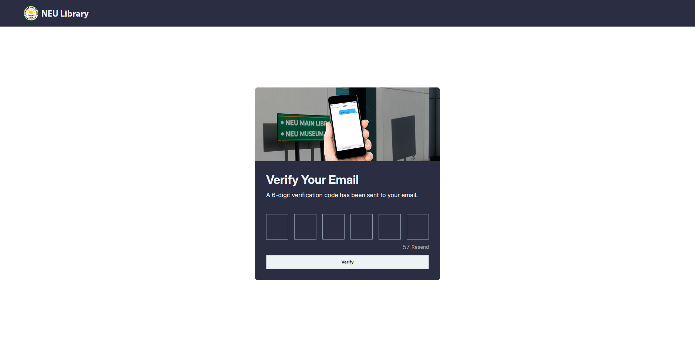
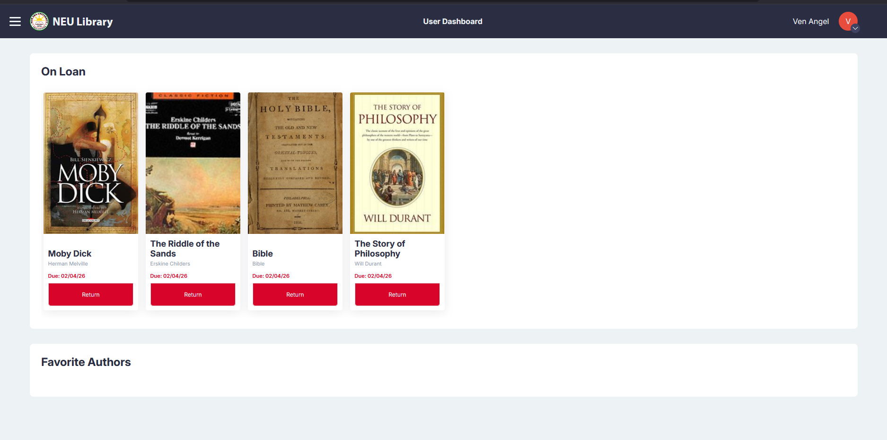
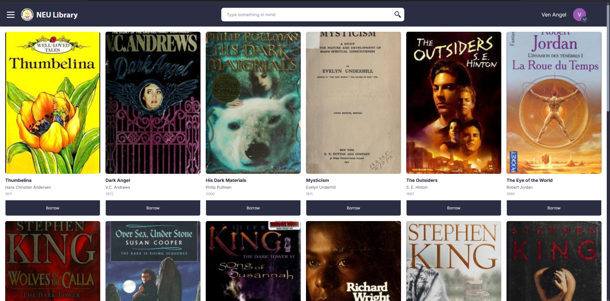
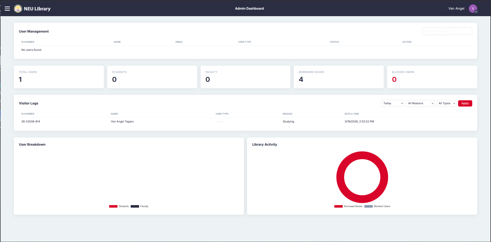
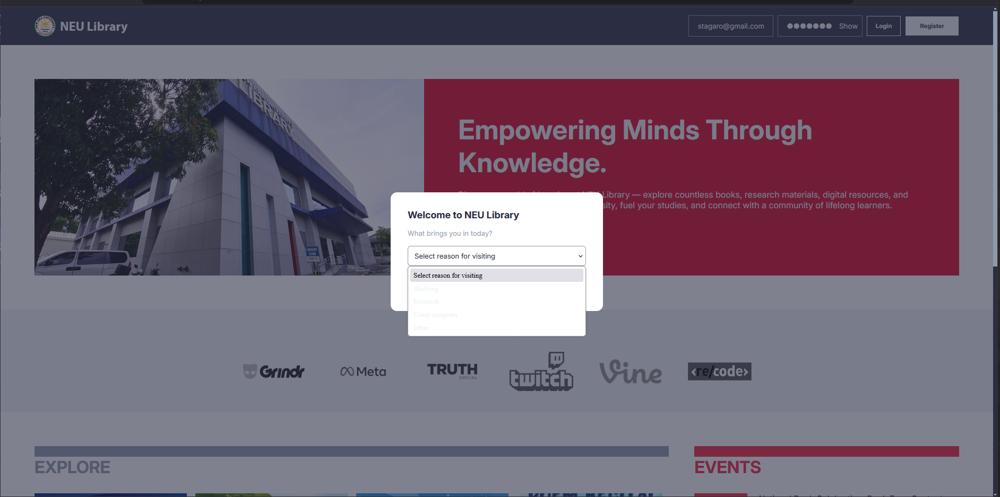

# NEU Library

A full-stack web simulation of our school's library system. Originally scoped as a visitor log system, it evolved into a broader library simulation to experiment and learn backend development and database design.

🔗 **Live Demo:** [insert link here]

---



---

## Screenshots

| Verification                                 |
| -------------------------------------------- |
|  |

| Dashboard                                 | Catalog                               |
| ----------------------------------------- | ------------------------------------- |
|  |  |

| Admin Dashboard                            | Reason Modal                           |
| ------------------------------------------ | -------------------------------------- |
|  |  |

---

## Features

### Authentication

- Sign up with institutional email — credentials are sent via **EmailJS**
- Login using **email or system-generated ID number**
- Account verification via **6-digit code** sent to email on first login
- Unverified accounts older than 1 hour are automatically cleaned up

### Visitor Logging

- Students and Faculty are prompted to select a **reason for visiting** every time they log in
- Visit logs are stored in the database with timestamp
- Reasons: Studying, Research, Using Computer, Other

### Borrowing System

- Browse books from the **Open Library API** — randomized mixed catalog
- Borrow any book — due date auto-set to **2 weeks** from borrow date
- Return books directly from the dashboard

### Admin Dashboard

- View total **students**, **faculty**, **borrowed books**, and **blocked users**
- Donut charts for user breakdown and library activity
- **User management** — search, block, and unblock users
- **Visitor logs** — filter by today, this week, or custom date range; filter by reason and user type

### Navigation

- Hamburger button opens/closes the sidebar
- Users can log out from the navbar dropdown

---

## Tech Stack

- **Frontend** — HTML, CSS, Vanilla JavaScript
- **Backend** — Node.js, Express.js
- **Database** — MySQL (Railway)
- **Email** — EmailJS
- **Books** — Open Library API
- **Scheduler** — node-cron

---

## Setup

```bash
npm install
node server.js
```

Create a `.env` file:

```
DB_HOST=
DB_PORT=
DB_USER=
DB_PASSWORD=
DB_NAME=
```

---

## Notes

- This project didn't strictly follow all system requirements — the goal was to learn by building things from scratch, with AI used to explain concepts along the way
- QR code scanning was not implemented
- College filtering is not yet implemented as not all users may belong to a specific college
- Originally used SMTP for emails, then switched to downloadable credentials (due to Vercel/Render blocking SMTP ports), then eventually moved to EmailJS
